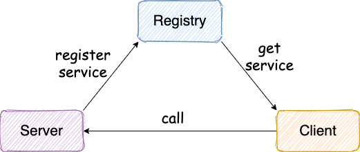
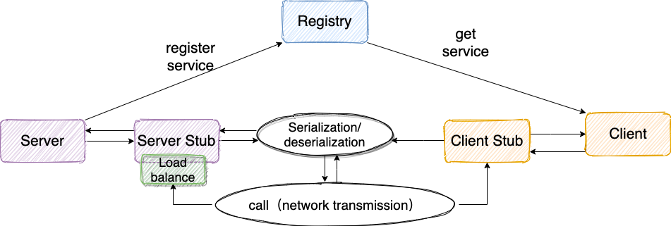

# simple-rpc
## 介绍
`simple-rpc`是一款基于 Netty+Kyro+Zookeeper 实现的 RPC 框架。代码注释详细，结构清晰，并且集成了 Check Style 规范代码结构，非常适合阅读和学习。
## RPC 框架设计思路



服务提供端Server向注册中心注册服务,服务消费者通过注册中心拿到服务相关信息,然后通过网络请求服务提供端Server

比较完整的RPC框架如下图

其中涉及到注册中心,网络传输,序列化,动态代理,负载均衡等模块

1. **注册中心（Service Registry）**：
    - **作用**：注册中心用于服务的注册和发现。服务提供者在注册中心注册其提供的服务，而服务消费者可以查询注册中心以获取可用的服务实例列表。
    - **具体作用**：允许动态添加或移除服务提供者，提供服务发现、服务注册和服务下线的功能。通常用于管理分布式系统中的服务。

2. **网络传输**：
    - **作用**：网络传输是RPC框架的核心组成部分，用于在客户端和服务器之间传递数据和调用信息。它负责处理底层的通信细节，如数据的传输和协议的处理。
    - **具体作用**：确保客户端和服务器之间的通信是可靠的、高效的，通常使用TCP/IP或HTTP等协议进行数据传输。

3. **序列化（Serialization）**：
    - **作用**：序列化是将数据转换为可传输或持久化的格式的过程。在RPC中，序列化用于将调用参数和返回值转换为字节流，以便在网络上传输。
    - **具体作用**：确保数据在不同系统或语言之间可以进行有效的传输和解析，通常使用JSON、XML、Protocol Buffers等序列化格式。

4. **动态代理（Dynamic Proxy）**：
    - **作用**：动态代理用于在客户端和服务器之间创建代理对象，以便客户端可以调用远程服务的方法，而不必实际了解底层的网络通信细节。
    - **具体作用**：简化客户端和服务器之间的通信，使其看起来像本地方法调用。通常使用Java的动态代理或字节码生成技术来实现。

5. **负载均衡（Load Balancing）**：
    - **作用**：负载均衡是在多个服务提供者之间分配请求的过程，以确保系统的负载分布均匀，提高性能和可用性。
    - **具体作用**：根据一定策略选择合适的服务提供者，如轮询、随机、加权轮询等，以实现负载均衡。确保请求不会过度集中在某个提供者上。

总的来说，这些组件和概念在RPC框架中协同工作，以构建分布式系统中的通信和服务调用。注册中心用于服务管理，网络传输负责数据传输，序列化处理数据格式，动态代理简化客户端调用，而负载均衡确保系统的性能和可用性。

## 项目实现功能
- 使用 Netty（基于 NIO）替代 BIO 实现网络传输；
- 使用开源的序列化机制 Kyro（也可以用其它的）替代 JDK 自带的序列化机制；
- 使用 Zookeeper 管理相关服务地址信息
- Netty 重用 Channel 避免重复连接服务端
- 使用 CompletableFuture 包装接受客户端返回结果（之前的实现是通过 AttributeMap 绑定到 Channel 上实现的） 详见：使用 CompletableFuture 优化接受服务提供端返回结果
- 增加 Netty 心跳机制 : 保证客户端和服务端的连接不被断掉，避免重连。
- 客户端调用远程服务的时候进行负载均衡 ：调用服务的时候，从很多服务地址中根据相应的负载均衡算法选取一个服务地址。ps：目前实现了随机负载均衡算法与一致性哈希算法。
- 处理一个接口有多个类实现的情况 ：对服务分组，发布服务的时候增加一个 group 参数即可。
- 集成 Spring 通过注解注册服务
- 集成 Spring 通过注解进行服务消费。
- 增加服务版本号 ：建议使用两位数字版本，如：1.0，通常在接口不兼容时版本号才需要升级。为什么要增加服务版本号？为后续不兼容升级提供可能，比如服务接口增加方法，或服务模型增加字段，可向后兼容，删除方法或删除字段，将不兼容，枚举类型新增字段也不兼容，需通过变更版本号升级。
- 对 SPI 机制的运用
- 增加可配置比如序列化方式、注册中心的实现方式,避免硬编码 ：通过 API 配置，后续集成 Spring 的话建议使用配置文件的方式进行配置
- 客户端与服务端通信协议（数据包结构）重新设计 ，可以将原有的 RpcRequest和 RpcReuqest 对象作为消息体，然后增加如下字段（可以参考：《Netty 入门实战小册》和 Dubbo 框架对这块的设计）：
- 魔数 ： 通常是 4 个字节。这个魔数主要是为了筛选来到服务端的数据包，有了这个魔数之后，服务端首先取出前面四个字节进行比对，能够在第一时间识别出这个数据包并非是遵循自定义协议的，也就是无效数据包，为了安全考虑可以直接关闭连接以节省资源。
- 序列化器编号 ：标识序列化的方式，比如是使用 Java 自带的序列化，还是 json，kyro 等序列化方式。
- 消息体长度 ： 运行时计算出来。

## 运行项目

### 运行zookeeper

使用docker安装

```shell
docker pull zookeeper:3.5.8
 
docker run -d --name zookeeper -p 2181:2181 zookeeper:3.5.8
```

### 使用

#### 服务提供端

##### 实现接口

```java
@Slf4j
@RpcService(group = "test1", version = "version1")
public class HelloServiceImpl implements HelloService {
    static {
        log.info("HelloServiceImpl init");
    }
    @Override
    public String hello(Hello hello) {
        log.info("HelloServiceImpl收到: {}.", hello.getMessage());
        String result = "Hello description is " + hello.getDescription();
        log.info("HelloServiceImpl返回: {}.", result);
        return result;
    }
}

```

##### 发布服务

- netty通信时发布服务

  ```java
  @RpcScan(basePackage = {"com.github.sunzy"})
  public class NettyServerMain {
      public static void main(String[] args) {
          // Register service via annotation
          AnnotationConfigApplicationContext applicationContext = new AnnotationConfigApplicationContext(NettyServerMain.class);
          NettyRpcServer nettyRpcServer = (NettyRpcServer) applicationContext.getBean("nettyRpcServer");
          // Register service manually
          HelloService helloService2 = new HelloServiceImpl();
          RpcServiceConfig rpcServiceConfig = RpcServiceConfig.builder()
                  .group("test1").version("version1").service(helloService2).build();
          nettyRpcServer.registerService(rpcServiceConfig);
          nettyRpcServer.start();
      }
  }
  ```

- socket通信发布服务

  ```java
  public class SocketServerMain {
  
      public static void main(String[] args) {
          HelloServiceImpl helloService = new HelloServiceImpl();
          SocketRpcServer socketRpcServer = new SocketRpcServer();
          RpcServiceConfig rpcServiceConfig = new RpcServiceConfig();
          rpcServiceConfig.setService(helloService);
          socketRpcServer.registerService(rpcServiceConfig);
          socketRpcServer.start();
      }
  
  }
  ```

#### 客户端调用

HelloController

```java
@Component
public class HelloController {
    @RpcReference(version = "version1", group = "test1")
    private HelloService helloService;

    public void test() throws InterruptedException {
        String hello = this.helloService.hello(new Hello("111", "222"));
        Thread.sleep(2000);
        for (int i = 0; i < 10; i++) {
            System.out.println(helloService.hello(new Hello("111", "222")));
        }
    }
}
```

SocketClientMain

```java
public class SocketClientMain {
    public static void main(String[] args) {
        RpcRequestTransport rpcRequestTransport = new SocketRpcClient();
        RpcServiceConfig rpcServiceConfig = new RpcServiceConfig();
        RpcClientProxy rpcClientProxy = new RpcClientProxy(rpcRequestTransport, rpcServiceConfig);
        HelloService helloService = rpcClientProxy.getProxy(HelloService.class);
        String hello = helloService.hello(new Hello("111", "222"));
        System.out.println(hello);
    }
}
```


执行结果


